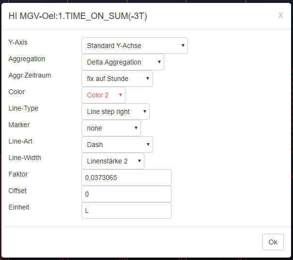
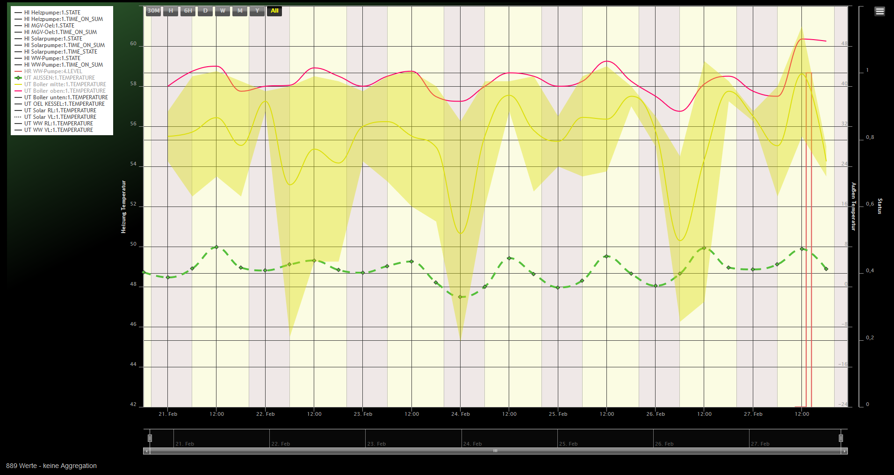

# CCU-Historian-HC  
Add HighChart to [CCU-Historian](https://github.com/mdzio/ccu-historian)  
This project combine interactive charts with the database of CCU-Historian. All can be done in one page.  

# Installation  
1. Install first [CCU-Historian](https://github.com/mdzio/ccu-historian), as some directory and the web server will be used
2. create below /usr/local/addons/ccu-historian/ccu-historian/webapp/custom an new directory like "h2-highchart"
3. copy all files from directory "h2-highchart" to above created directory.
4. change config file from CCU-Historian to include this as customer side in the menu
   
   add following lines to file **"/usr/local/addons/ccu-historian/ccu-historian.config"**:  
   (if link1 already exits, use next free number)  
   * webServer.menuLinks.link1.text='H2-HighChart'  
   * webServer.menuLinks.link1.address='/custom/h2-highchart/H2-HighChart.gy'  
   
Now this side should be available in CCU-Historian like:  
  
  
**Over the Popup-Menue the screen can be adjusted:**  
  

Over the chart you can select which timeframe should be loaded from the database and over room, function and key the legend can be filtered.

Over the legend you can select/deselect the datapoint you want to see on the chart.

11 axis are at the moment build in automatic. % percentage (0-100%), state (0 or 1) and all others.  

As highlight is in the background gray for night (20:00 - 06:00) and yellow for day ( 06:00 - 20:00). This can be activate or deactivate over the popup-menue.

With button "Link erzeugen" you can create an Link which will open a new window and this could be also used as shortcuts. 
The whole selection will be added to this link also zoom, periode, daylight, legend, navigator, all selected datapoint, all filters

http://<host>:<port>/custom/h2-highchart/H2-HighChart.gy?periode=??dp=131|Y5|L1|V1|A1,???&room=??&function=??&filterkey=??&zoom=??&legend=false&navigator=false&labels=true&daylight=false&filterline=false&theme=dark-green

Parameters for dp=<CCU-Historian-ID>|A0|Y0|L0|F0|C0|M0|V2  
   * A0 - Aggregation (0-no, 1-dyn, 2-delta, 3-min/max, 4-sum)
   * T1 - Aggregation Time (0-dyn, 1-dyn. 15min, 2-no/hour/day, 3-fix hour, 4-fix day, 5-fix week, 6-fix month, 7-fix quarter
   * Y0 - Y-axis (0-13)
   * L0 - Linetype (0-SP-line, 1-Line, 2-Line/left, 3-Line/center, 4-Line/right, 5-Scatter, 
          6-SP-Area, 7-Area, 8-Area/left, 9-Area/center, 10-Area/right, 11-column)
   * F0 - Color (0-len out of Themes variable Color)
   * C0 - Comparisation (0-none, 1-day-1, 2-day-2, 3-day-3, 4-day-4, 5-week-1, 6-week-2, 7-week-3, 8-week-4, 9-12-month, 13-year
   * M0 - Marker (0-none, 1-circle, 2-diamont, 3-squar, 4-triangle, 5-triangle-down)
   * V2 - Visible (0-not, 1-deacitated, 2-activated)
   * D0 - Dashtype (0-solid,1-Dash,2-DashDot,3-Dot,4-LongDash,5-LongDashDot,6-LongDashDotDot,7-ShortDash,
          8-ShortDashDot,9-ShortDashDotDot,10-ShortDot
   * W2 - Line width (0-10)
   * X1 - Multiplication factor of value, standard 1 = no effect
   * O0 - Offset, will be add to every value
   * Ukg - Unit which should be used
  
This options can be set on click to a line/point on the chart.
 

Add new themes: dark-green, avocado, dark-blue, dark-unica, gray, grid-light, grid, skies, sunset
 

Fullscreen is possible with:  
   * hide filter line
   * navigator
   * legende

Refresh time can be set in url as default 60 sec. with "&refresh=true" or "&refresh=300" (for 5 Min. or 300 sec.)

Example for CUxD.SUM_ON_TIME where we get minutes:

Some with Delta Aggregation and Daily Aggregation additional factor 0.0373065 for L and new Unit L, here the settings:

and the outcome:

Same with aggregation time Fix to hour:

