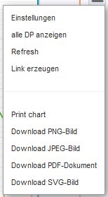
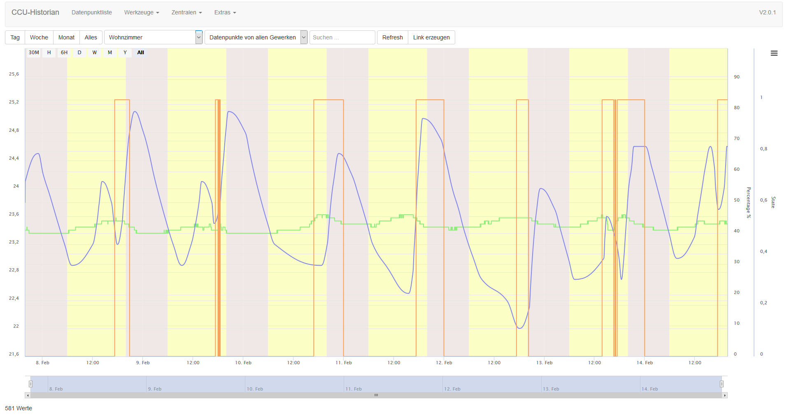

# CCU-Historian-HC
Add HighChart to [CCU-Historian](https://github.com/mdzio/ccu-historian)

# Installation
1. Install CCU-Historian 
2. create below webapp/custom/ an new directory like "h2-highchart"
3. copy all files from directory "h2-highchart" to above created one.
4. change config file from CCU-Historian to include this as customer side in the menu
   
   add following lines to file ccu-historian.config: (if link1 already exit use next free number)
   * webServer.menuLinks.link1.text='H2-HighChart'
   * webServer.menuLinks.link1.address='/custom/h2-highchart/H2-HighChart.gy'
   
Now this side should be available in CCU-Historian like:

Over the Popup-Menue the screen can be adjusted:

Over the legend and highchart you can select over button which timeframe will be loaded from the CCU-database and over room, function and key the legend can be filtered.

Over the legend you can select which datapoint you want to see on the chart.

3 axis are at the moment build in automatic. % percentage (0-100%), state (0 or 1) and all others.

With button "Link erzeugen" you can create an Link which will open a new window and this could be also used as shortcuts. 
The whole selection will be added to this link also zoom, periode, daylight, legend, navigator, all selected datapoint, all filters

http://<host>:<port>/custom/h2-highchart/H2-HighChart.gy?periode=??&room=??&function=??&filterkey=??&zoom=??&legend=false&navigator=false&labels=true&daylight=false

